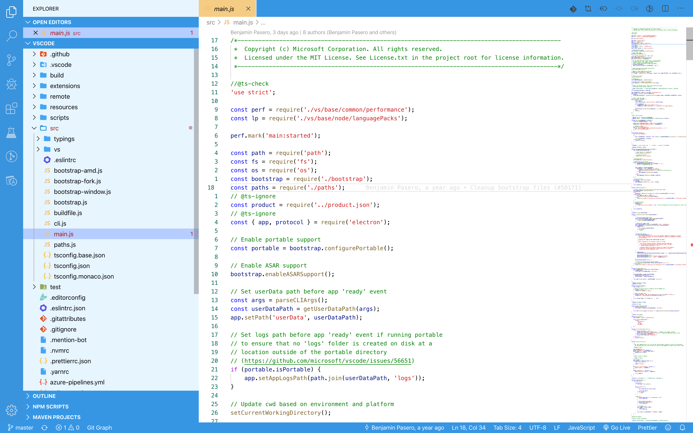

# Blue Themes
Blue selection of themes for visual studio code.

## Installation

Open a terminal and go to the blue-themes directory, and type this command replacing 'X.X.X' with your version.

```Shell
code --install-extension blue-themes-X.X.X.vsix
```

## Blue Light



## Blue Dark


